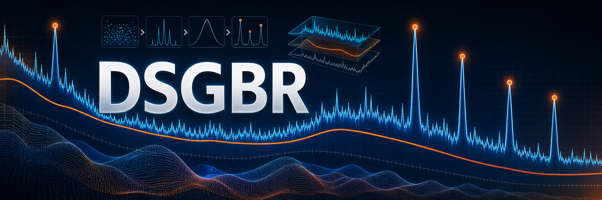
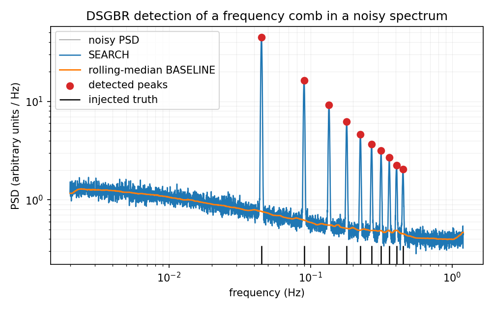
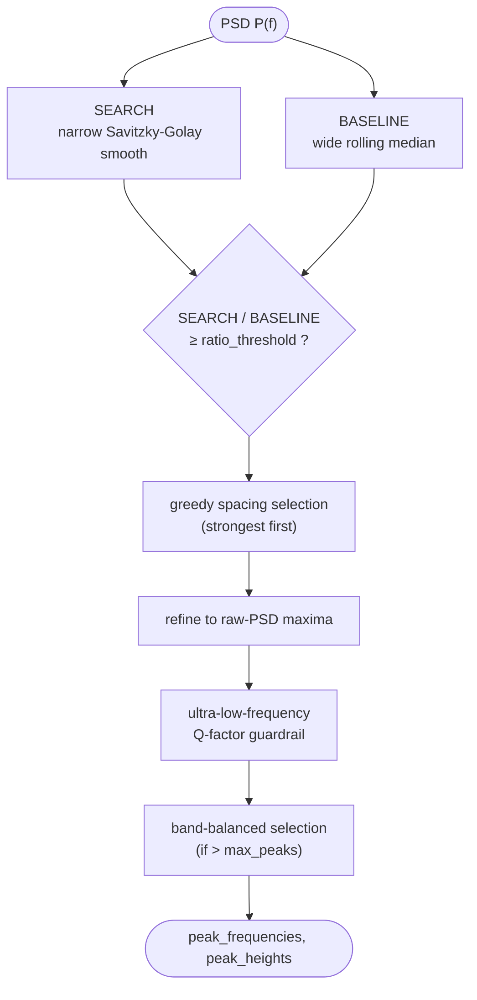

[](https://pypi.org/project/dsgbr/)
[](https://github.com/ricardofrantz/dsgbr#readme)
[](https://github.com/ricardofrantz/dsgbr/actions/workflows/ci.yml)
[](https://pypi.org/project/dsgbr/)
[](LICENSE)

**Dual Savitzky-Golay Baseline Ratio (DSGBR)** detects spectral peaks in
frequency-domain signals. It is built for dense, noisy power spectra from fluid
dynamics, vibration analysis, and related experimental work, where spectra
slope over several decades and a fixed prominence threshold either drowns in
low-frequency power or misses everything at high frequency.



Noisy synthetic spectrum with injected peaks, generated by
`examples/readme_figure.py` using the default detector parameters.

## Install

```bash
pip install dsgbr
```

For development:

```bash
git clone https://github.com/ricardofrantz/dsgbr.git
cd dsgbr
uv pip install -e ".[dev]"
```

## Quick start

```python
import numpy as np
from dsgbr import dsgbr_detector

# Synthetic PSD with known peaks
frequencies = np.linspace(0.001, 1.0, 2048)
psd = np.ones_like(frequencies)
psd[400] = 12.0  # inject a peak
psd[1200] = 8.0  # inject another

peak_f, peak_h = dsgbr_detector(frequencies, psd)
print(f"Detected {peak_f.size} peaks at f = {peak_f}")
```

The defaults find both peaks. To tune, pass a `case_info` dictionary with
full names or short aliases:

```python
peak_f, peak_h = dsgbr_detector(frequencies, psd, case_info={"RT": 2.5, "SW": 5})
```

## How it works

DSGBR compares the spectrum against a local estimate of its own background,
so acceptance is a *ratio* rather than an absolute height: a peak three
times above its surroundings is detected the same way at any frequency,
regardless of the slope between them.



The two series are deliberately different estimators: **SEARCH** is a narrow
Savitzky-Golay smooth that suppresses single-bin noise while keeping peak
shapes, and **BASELINE** is a wide rolling median of the raw PSD, which sits
under narrow peaks instead of being dragged up by them. Accepted candidates
then pass spacing rules, are repositioned onto the raw PSD, and survive an
ultra-low-frequency guardrail that rejects broad leakage bumps near the left
edge of the spectrum. The full pipeline, design rationale, and parameter
sensitivity study are in [`docs/algorithm.md`](docs/algorithm.md).

## Validation

| Scenario      | DSGBR F1      | tuned find_peaks F1 |
| ------------- | ------------- | ------------------- |
| clean_tones   | 1.000 ± 0.000 | 1.000 ± 0.000       |
| dense_lowfreq | 0.658 ± 0.246 | 0.440 ± 0.310       |
| steep_slope   | 0.967 ± 0.103 | 0.872 ± 0.149       |
| noisy_welch   | 0.447 ± 0.251 | 0.296 ± 0.312       |
| no_peaks      | 0.000 ± 0.000 | 0.000 ± 0.000       |

Fresh run: `uv run python -m benchmarks.compare`, 20 evaluation realizations per
scenario after per-scenario tuning of `scipy.signal.find_peaks` on 8 training
realizations.

DSGBR leads on the sloped, dense, and noisy scenarios above; parity is expected
for flat, well-separated peaks such as `clean_tones`, and both detectors return
no F1 credit on `no_peaks`. See [`docs/algorithm.md` Parameter
sensitivity](docs/algorithm.md#parameter-sensitivity) and [`benchmarks/`](benchmarks/)
for reproduction.

## Configuration

All parameters are set through `DetectionConfig` or passed as a dictionary
via the `case_info` argument. Short aliases (RT, SW, BWF, etc.) are
supported for concise configuration.

| Parameter              | Alias | Default      | Description                                  |
| ---------------------- | ----- | ------------ | -------------------------------------------- |
| `ratio_threshold`      | RT    | 3.3          | Min SEARCH/BASELINE ratio for acceptance     |
| `smooth_window`        | SW    | 3            | Savitzky-Golay window for SEARCH (odd, >= 3) |
| `baseline_window_frac` | BWF   | 0.05         | Baseline window as fraction of data length   |
| `distance_low`         | DL    | 2            | Min bin separation below `switch_frequency`  |
| `distance_high`        | DH    | 1            | Min bin separation above `switch_frequency`  |
| `switch_frequency`     | SF    | 0.02         | Frequency threshold for spacing rules        |
| `max_peaks`            | MP    | 25           | Maximum peaks returned                       |
| `smooth_polyorder`     | —     | 2            | Polynomial order for SG filter               |
| `smooth_on_log`        | —     | True         | Smooth log10(PSD) instead of linear          |
| `baseline_window`      | —     | None         | Fixed baseline window (overrides BWF)        |
| `baseline_on_log`      | —     | True         | Baseline smoothing in log domain             |
| `band_strategy`        | —     | proportional | Band allocation: proportional or equal       |
| `n_bands`              | —     | 10           | Number of logarithmic frequency bands        |
| `ulf_fmax`             | —     | 0.001        | ULF band upper frequency limit               |
| `ulf_min_q`            | —     | 9.0          | Minimum Q-factor for ULF peaks               |
| `ulf_max_points`       | —     | 5            | Maximum ULF peaks to retain                  |

## Advanced usage

### Support series for visualization

```python
from dsgbr import compute_support_series

support = compute_support_series(frequencies, psd, case_info={"RT": 2.0})

# Plot SEARCH vs BASELINE overlay
import matplotlib.pyplot as plt
plt.semilogy(frequencies, support["search_series"], label="SEARCH")
plt.semilogy(frequencies, support["baseline_series"], label="BASELINE")
plt.semilogy(frequencies, support["rthreshold"], "--", label="Threshold")
plt.legend()
plt.show()
```

### Band-balanced peak selection

```python
from dsgbr import select_peaks_by_frequency_bands

# Reduce 100 peaks to 15, spread across frequency bands
sel_f, sel_h = select_peaks_by_frequency_bands(
    peak_frequencies, peak_heights,
    max_peaks=15, strategy="proportional", n_bands=8,
)
```

### Configuration via dataclass

```python
from dsgbr import DetectionConfig

cfg = DetectionConfig(ratio_threshold=2.5, smooth_window=7, max_peaks=10)
print(cfg.to_metadata())
```

## API reference

| Function / Class                                                         | Description                                  |
| ------------------------------------------------------------------------ | -------------------------------------------- |
| `dsgbr_detector(f, psd, *, case_info, return_support)`                   | Main detection pipeline                      |
| `compute_support_series(f, psd, case_info)`                              | Return intermediate arrays for visualization |
| `select_peaks_by_frequency_bands(f, h, *, max_peaks, strategy, n_bands)` | Band-balanced down-selection                 |
| `find_nearest_frequency(target, frequencies, heights)`                   | Closest detected frequency lookup            |
| `DetectionConfig`                                                        | Frozen dataclass with 17 parameters          |
| `detect_peaks_case_adaptive(...)`                                        | Deprecated alias for `dsgbr_detector`        |
| `DSGBR_PARAM_ALIASES`                                                    | Short-to-long parameter name mapping         |

## Examples

See [`examples/`](examples/) for runnable scripts:

- **`basic_usage.py`** — minimal detection example
- **`parameter_tuning.py`** — sweep ratio_threshold, compare peak counts
- **`visualization.py`** — SEARCH/BASELINE overlay plot
- **`readme_figure.py`** — regenerate the figure at the top of this page

## Citation

If you use DSGBR in your research, please cite:

```bibtex
@software{dsgbr2026,
  author = {Frantz, Ricardo},
  title = {{DSGBR}: Dual Savitzky--Golay Baseline Ratio spectral peak detector},
  year = {2026},
  url = {https://github.com/ricardofrantz/dsgbr},
}
```

## License

BSD 3-Clause. See [LICENSE](LICENSE).

## Contributing

Contributions are welcome. Please open an issue to discuss changes before
submitting a pull request. Run the full QA suite before submitting:

```bash
uv pip install -e ".[dev]"
pre-commit run --all-files
pytest --cov=dsgbr
```
